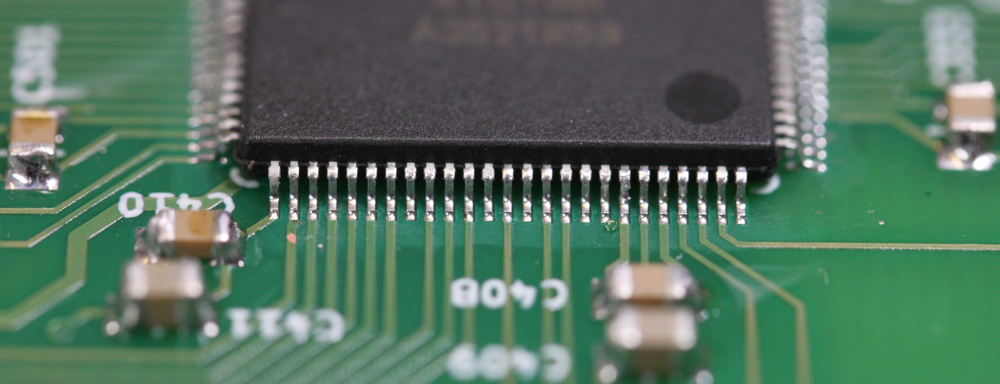
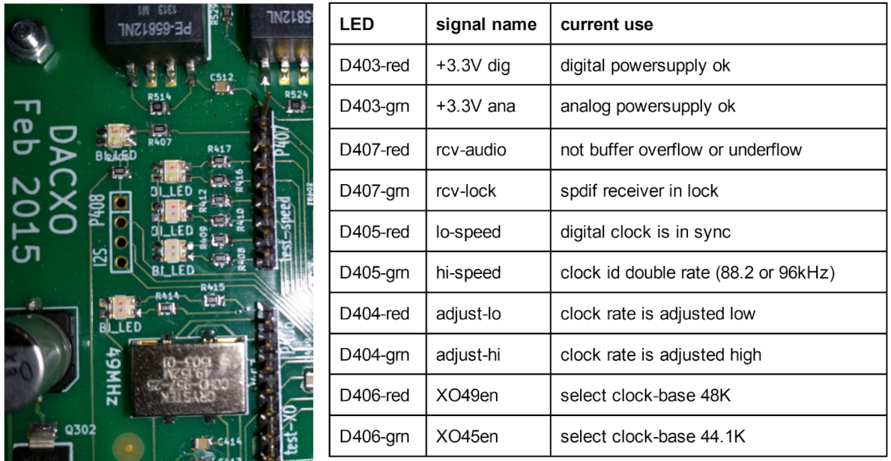
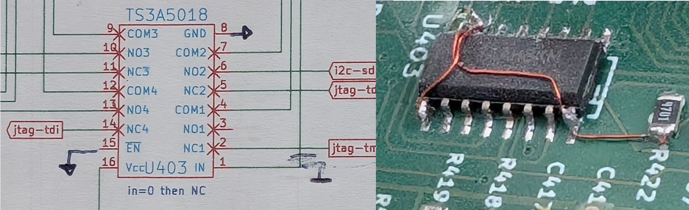
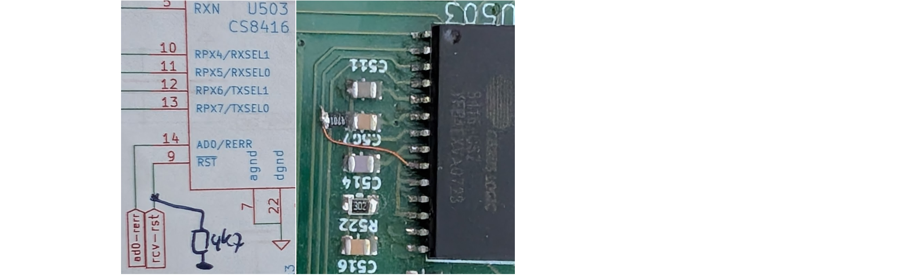

# Audio DAC main digital PCB
## Introduction
The 'digital PCB' implements the most interesting parts of this DAC design.
It is provided here with a global description below, pdf files
of the [schematics](./dac5-schem-eurocircuits-20150214.pdf) and
[PCB layout](./dac5-eurocircuits.pdf), and the original [KiCad](https://www.kicad.org/) design files.

## Board inputs and outputs

The PCB provides five digital audio inputs:
  - Two optical s/pdif inputs
  - Two coax s/pdif inputs
  - One i2s input

The analog audio outputs are *intermediate*, needing further handling by a separate analog PCB.
These outputs are the direct chip outputs of the (now mounted) pair of *PCM1792A* DAC chips.
They operate in *dual mono* mode, and provide for each audio channel a differential current output of 2x 15.6mA p-p, on top of a DC current offset of 12.4 mA.

For control of the board, an i2c input is used.
An external microcontroller board shall be used to implement the control. This includes settings such as:

- Setup initialization of chip operating modes.
- Audio volume and balance
- Input source selection
- Power on versus standby mode

Besides these settings, the microcontroller can read status information such as:

- currently selected xtal oscillator
- signal presence and sample rate of the current s/pdif input
- current status of the audio buffer and clock rate adjustment (see PLL description below)

Based on the s/pdif received audio signal, the board hardware will automatically select
one the two xtal oscillators and a clock divider to match the samplerate of the signal.
This logic is implemented in the on-board FPGA, a *MachxXO2-100* from Lattice Semiconductor,
denoted *U306* in the [schematics](./dac5-schem-eurocircuits-20150214.pdf).

For power supply, the board takes a separated:

- Analog supply as a raw (unrectified) input from 2x7V transformer.
- Digital supply as a raw 5V dc from an external small smps (switch-mode power supply).
  The chosen 1A (5 watt) power is plenty for this design.
  I selected a high quality type, approved for medical applications, manufactured by Mean Well.

Furthermore, the board provides:

- a USB input for programming the FPGA.
- several connectors for easy access to measure and debug various on-board signals.
- a few LEDs for quick visual feedback on status.

## s/pdif receiver

The CS8416 (*U503* in the [schematics](./dac5-schem-eurocircuits-20150214.pdf))
is used to receive the s/pdif datastream and select between
four inputs: two optical and 2 coax. The coax inputs are implemented with high-frequncy isolation transformers
for a good isolation of common-mode disturbance. In general, coax connections seems to have a preferrable
signal transfer.

The PCB allows the CS8416 to operate in eiter its 'SW mode' or its 'HW mode'.
A 47k resistor can shall placed in either *R505* for SW mode, or in *R501* for HW mode.
Initially, during board testing, SW mode was used. In the final design, HW mode is used,
where the various control wires are provided by the FPGA.
(The two modes rely on a different FPGA content.)

The audio clock which is recovered by the CS8416 from s/pdif is in sync with the audio bitstream,
and used to clock the audio data into the FPGA buffer. This clock is considered *dirty* in this design,
so is NOT used for the output clock on the DAC chips.

## Achieving low jitter

To achieve low jitter performance, different causes of jitter need to recognized and addressed.
This is distinguished in aspects 1 to 5 below:

### 1. Oscillator (reference clock) stability
Low jitter in the main audio reference clock, corresponds to low oscillator phase noise.
This design uses the Crystek CCHD-957 crystal oscillator, which has the best phase noise specification I could find,
while easy to acquire in small volume. Phase noie is typically expressed in a frequency plot. A key number
would be the *-130dB noise level* at *100Hz deviation* from its center frequency.
The design actually uses two of these oscillators, at 45.1584 MHz and 49.152 MHz.
These frequencies correspond to 1024 * 44.1 kHz and 1024 * 48 kHz. Having both these clock frequencies
allows the playback of relevant audio sample rates without complex (non-power-of-two) resampling,
to avoid related conversion artefacts.

### 2. Re-clocking of digital audio signals
To achieve low jitter on the signals that enter the DAC chips, the audio data, audio bit-clock and audio word-clock signals
are *re-clocked*: they pass through a clocked register (U307 in the schematic) which is
clocked directly by the xtal reference clock. There should be absolutely minimal (best none at all) logic between
the crystal reference clock and the clock input of this register.
This shall minimise the build-up of jitter on signals that pass through logic gates.

### 3. Low-noise power supply on the digital ciruits
All CMOS logic gates have a gate-delay which strongly depends on the power-supply voltage.
You can easily check this on any *74hc* logic family datasheet. A gate delay of -lets say- 10ns can easily vary +/- 1 ns
when its powersupply voltage has small dips or peaks. That is an *enormous* variation in delay, as we aim for
jitter in the 10ps to 100ps range. Note furthermore, that we need to have a stable power supply voltage
*on the chip die itself*, not only on the external package pins.
This results in a preference for less logic per chip, less logic sharing a common power-supply pin.

In this schematic, the *3.3Vana* is made from a 2.5V reference, RC-filtered for noise,
and amplified/buffered with a low-noise opa2227 opamp.
This low-noise supply voltage is used for the crystal oscillators, the re-clock register,
and the digital supply of the DAC chips.
In *standby* mode, this *3.3Vana* with its off-PCB transformer is switched off.

The other digital circuitry (the FPGA and the s/pdif receiver) are supplied from a separate 3.3V 'digital' power voltage.
This same 'digital' power supply also provides a +5V to the front panel microcontroller
through the 4-pin i2c connector (P402 in the schematics).
The 'digital' power comes from an off-board +5V small SMPS (switch-mode power supply).
In *stand by* mode, this 'digital' power will remain on.

### 4. Reduce EMI-induced noise
Electromagnetic Interference (EMI) induced noise is caused by high-frequency
elecromagnetic fields that spread around the PCB surface, and can cause
signal degradation and jitter. (Here, with 'high frequency' we worry about
frequencies in the order of 100Mhz to 1GHz.)

For a clean supply voltage and reduced EMI fields, a well-designed
[power-supply decoupling](https://www.murata.com/en-eu/products/emc/emifil/library/knowhow/basic/s2-chapter06-p1)
is required on all digital ICs.
This is achieved by:

- a local power supply decoupling capacitor very close to each chip.
- a high-frequency-suppression chip-inductor in the power-supply line for each chip.

The inductor makes sure that the high-freqency switching currents remain local to the chip and its decoupling capacitor.
Keeping these currrents local (in a very small loop) strongly reduces the EMI noise around the PCB.

Furthermore, small (47R to 470R) series-resistances are inserted in series in many
of the audio data and clock lines. These reduce peak currents
and [high-frequency ringing](https://www.protoexpress.com/blog/how-to-reduce-ringing-in-pcb-designs/)
on these signals on the PCB.

### 5. Phase Locked Loop design
Creating a good-sounding DAC from s/pdif inputs (optical or coax) poses a major extra challenge on *clock synchronisation*.
Note that an i2s or usb sound input can easily and totally avoid this issue.
S/pdif audio is received with its own clock. Recovering that received clock from the s/pdif signal
inevitably leads to a bad (unstable, high jitter) clock signal.
Unfortunately, a local fixed-frequency crystal oscillator cannot directly replace
that 'bad' clock, because it typically deviates from the frequency of the received
audio data stream: crystal oscillators typically deviate by +/- 100ppm (or 0.01%) from the nominal frequency (and the received stream).
To overcome this potential difference in center-frequency, some solution must be implemented.

*Option 1:*
Directly using the s/pdif retrieved clock for the DAC output is only done in the cheapest designs,
with crappy sound quality. The local crystal oscillator is simply omitted.

*Option 2:*
Traditionally, in vintage designs,
a clean clock might be re-created with an analog 'phased locked loop' (PLL). Such PLL contains a VCO (or VCXO): an oscillator
of which its frequence can be slightly tuned by an applied input voltage.
If the PLL has a low-frequency and low-noise filter for the control voltage, the jitter in the re-created clock
can be much lower then in the s/pdif-recovered clock.
In theory this can be good, but in practice this is extremely hard. Even good-quality VCXOs (voltage controlled crystal
oscillators) exhibit *much* higher jitter then the best fixed-frequency crystal oscillators.

*Option 3:*
Currently used by most DAC designs: The DAC always already contains a digital filter for purposes of sample rate
conversion (translating all digital sources to a common rate for the output) and oversampling (creating a
higher sample rate on the output). Now, if a 'dirty' input clock that provides the audio samples slightly deviates
in its average from the local fixed-frequency crystal oscillator, lets say by 100ppm, then after every 10.000 samples
some *new* sample must be inserted, or some received sample must be dropped. The digital filter
can then be used to 'smear' this sample artefact over a longer period.
As result, short-term (fast) jitter in the dirty input clock nicely disappears,
but very slow jitter in the input and deviation in the average data rate,
result in distortions (modified values) in the filtered output.

*Option 4:*
This DAC design takes a new approach, as far as I know. The input samples with their 'dirty' s/pdif clock are
stored in a cyclic buffer (a queue of samples). This buffer can be relatively small,
in this design it currently is 682 samples.
The high-quality crystal clock is used to take samples out of this queue to send to the DAC chips.
Note that this design uses an xtal clock of 1024x the standard (44.1kHz or 48kHz) sample rate.
If the buffer runs low (nearly empty), the clock divider to create the sample rate (word-)clock, is adjusted to be 1025.
Similarly, if the queue runs nearly full, the clock divider can be adjusted to 1023.
Effectively, this creates a nearly 0.1% deviation in the output clock rate.
Switching the output clock frequency +/- 0.1% occurs at low rate:
Suppose 640 samples in the queue need to be flushed or filled
at the modified frequency, that would take (640 / (samplerate x 0.1%)) is about 14 seconds.
Having the DAC speed-up or slow-down the output rate by 0.1% after about 14 seconds is truly in-audible.
For a high-resolution 24bit 96kHz datastream the duration of the updated clock speed is still about 6.6 seconds.
This design choice can be considered a digital PLL, with a very low-frequency filter loop.
Obviously, the good properties are that a) a high-quality low-jitter clock can be used,
and b) all original audio sample values are retained as is.

Because the number of buffered samples remains relatively small, it imposes a delay of at most 14 millisecond,
which means that the audio will remain in sync with video if the audio stream comes from an attached TV.

## i2s input

The extra i2s input is on the PCB as *P408*.
In i2s mode, the PCB assumes clock master mode, where it provides the bit-clock and word-clock to the interface.
So the peripheral (audio streamer) should:

1. Configure its i2s output in clock slave mode.
2. Pass control information from the audio stream through i2c to the FPGA to indicate
   the required sample rate.

In this clock master mode, there is no need to synchronize with any other clock.
Therefor, the fifo audio buffer is not used, nor is the +/- 0.1% clock rate adjustment.

On *P408*, the following pin assignment is used (set by the FPGA configuration):

- pin 1: gnd
- pin 2: audio data input
- pin 3: word clock output
- pin 4: bit clock output

After buffering with the crystal clock, these signals are passed as-is to the PCM1792 DAC chips.
So their format (e.g. msb-first, left aligned) should match.

## Selection of DAC chip
The PCB provides footprints for two different DAC chips: a pair of PCM1792A, or alternatively a pair of WM8741.
This is intended for comparison, but for now only the PCM has been used.
Clearly, only one of those pairs should be mounted!

## FPGA programming
The FPGA is a [Lattice Semiconductor MachXO2 family](https://www.latticesemi.com/en/Products/FPGAandCPLD/MachXO2)
device, in particular the LCMXO2-1200HC-4TG100I.
This FPGA features internal configuration storage, so no extrernal flash memory is needed.
It is housed in 100-pin TQFP package, which can still (barely) be hand-soldered on the PCB:

For easy programming of the onboard FPGA, a USB-to-jtag module is added to the PCB, denoted as *U401* in the schematics.
This is a DLP-USB1232H module from DLP Design. It is only used for programming the FPGA. During normal DAC
operation the module can harmlessly stay in place or can be removed.
During programming, the PCB takes +5V from this module, and no other external power is needed.
Note that there exist some late PCB wiring patches around its connection.

## On-board LEDs for diagnosis
The PCB has a number of LEDs that were convenient during early board
testing and debug. These are five bi-color (red-green) LEDs.
Their on/off status is according to the following table in matching top-down order:

## Late patches on the digital PCB
After assembly and test, a couple of small patches were done. These are not shown in the
original Kicad schematics: those still belong to the PCB design.

1. Add a small rectifier diode from '+5Vana' to 'V5raw' for protection against power-up errors.
2. 'U403' (for jtag programming) was badly connected: Lift 'pin1' to de-connect from the pcb,
  connect it to 'pin15' and 'pin8', and connect that triple to 'gnd'.
3. Replace R503 (47k) with 47 ohm.
4. Add a 4k7 resistor from 'rcv-rst' to 'gnd'.

Details on 2:

Pin 1 got lifted from the PCB, which is hard to see in the photo.

Details on 4:

  
