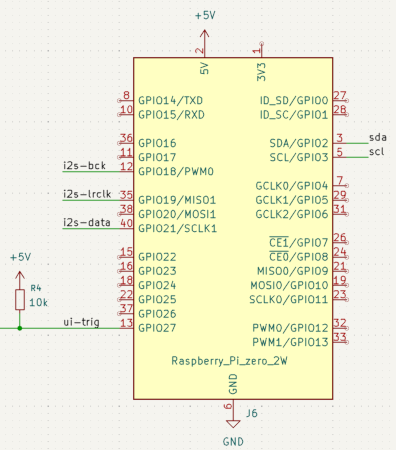

# Audio device driver for Linux

## Introduction

This DAC design initially/traditionally focussed on using the four s/pdif inputs on its digital board: two coax and two optical inputs.
However, the board also provides a fifth digital audio input:
an [i2s](https://en.wikipedia.org/wiki/I2S) input intended to connect
an audio network streaming device in the form of a Raspberry Pi.
I chose a tiny
[Raspberry Pi zero 2w](https://www.raspberrypi.com/products/raspberry-pi-zero-2-w/) for this purpose.

Connecting a Raspberry Pi through its *i2s* interface (in this design) keeps the DAC as
master clock, and uses the Pi as clock slave on this interface:
- This has the advantage of a clean clock with minimal jitter without any clock synchronization issues.
  (In contrast with using the classic s/pdif inputs.)
- It requires that -per song- the Pi informs the DAC board on the required sample-rate.

So, where the *i2s* interface is used to pass the audio data,
the Pi also uses an [i2c](https://en.wikipedia.org/wiki/I2C) connection
to the DAC board to communicate on the sample-rate.
In practice, this also enables the Pi to control the audio volume, input selection, and power-state,
and make the Pi a full-featured audio streamer.

For the Pi to obtain such control, it needs an audio device driver.
Such Linux kernel audio device driver is provided in this directory.

## Contents
- Creating the development setup
- Building and installing the device driver
- Initial testing of the device driver
- Activating the device driver on boot
- Choosing the DAC as system default audio device

## Creating the development setup
To build the device driver kernel modules, I opted (and would recommend)
for the simplicity of doing that on the target Raspberry Pi itself.
This as opposed to a more elaborate setup of a Pi cross-development environment
on another desktop computer.
Building and installing the kernel modules is highly dependent on the
precise version of the Linux kernel. Local development avoids a potential mismatch.
Also, after an OS update which increments the kernel version, these modules
can be easily rebuilt. 

The start environment is the plain [64-bit Rasberry Pi OS](https://www.raspberrypi.com/software/operating-systems/).
The *Lite* version, without desktop environment, is fine: we will only use
the Linux command-line [through an 'ssh' connection](https://www.raspberrypi.com/documentation/computers/remote-access.html#ssh).
Optionally, it might also be convenient to [share your Pi home directory](https://www.raspberrypi.com/documentation/computers/remote-access.html#samba) with your desktop.

All further text in thie README assumes that you are logged-in on the Pi,
maybe through *ssh*, and execute the commands locally on the Pi.

The Raspberry Pi OS comes with `gcc` and the required `include` files pre-installed, so we don't need to install that.

To obtain a copy of the source code in the Pi, it is easiest to install
`git`:
```
sudo apt install git
```
Since this git repository contains many more things, for just building
the Pi device drivers you probably want to `checkout` only the relevant directory.
That gains speed and reduces the size on your Pi's memory card.
```
git clone --filter=blob:none --sparse  --depth 1 git@github.com:JosVanEijndhoven/diyaudio-dac-preamp.git
cd diyaudio-dac-preamp
git sparse-checkout set dacxo-sw/RPi-audiodevice
git checkout
```
Now, `cd dacxo-sw/RPi-audiodevice` to see what you got and start building.

## The device driver source code files

The device driver C-code sources consists of various files in the `bcm` and `codecs`
sub-directory.

1. `bcm/jedac_bcm.c`: This is 'board control module', it specifies that there is an *i2c* connection to the board, to control the FPGA and the two pcm1792 dac chips.
Around [jedac5_bcm.c:343](jedac_soc_modules/bcm/jedac5_bcm.c#L343)
the *i2s* interface mode is set to `JEDAC_DAIFMT`.
This is defined in `codecs/jedac5.h` with (among others)
the value of `SND_SOC_DAIFMT_CBP_CFP`. This configures the Pi *i2s* interface
as clock slave, for both the bit-clock and the word-clock.
This board driver also takes care of powering-up the board if it would be in *standby*.

2. `codecs/jedac_codec.c`: It implements the *per audio stream*
dac sample rate control with the i2c registers in the FPGA.
3. `codecs/jedac.h`: constants regarding the codec, also passed to the `jedac5_bcm.c`.
4. `codecs/pcm1792a.h`: constants to drive the pcm1792a on-chip registers. code.


## Building and installing the device driver

The `Makefile` in this `RPi-audiodevice` directory defines targets for many actions.

The `jedac` device driver consists of two kernel modules:
- `jedac_bcm`, the *board control module*, or *card driver*.
- `jedac_codec`: the *codec* module.

To just build these in the current directory tree, you do:
```
make modules
```
The two built modules can be seen with `ls -l */*.ko`.

Besides these kernel modules, the driver needs a *device tree overlay*.
This specifies how/where these modules need to hooked into the Linux device tree.
This *device tree overlay* also needs to be compiled. So run:
```
make overlays/jedac.dtbo
```

If there are no fatal errors, proceed with installing these build results
in the Pi system directories. The following command uses `sudo` and might
ask for your password:
```
make install
```
It would be good to have the `i2c` and `i2s` connections activated in
the `/boot/firmware/config.txt`, by adding (uncommenting) the
following two lines. If they were absent, do a reboot:
```
dtparam=i2c_arm=on
dtparam=i2s=on
```

Now one can load the `jedac` driver at runtime in the kernel:
```
make test_dtoverlay
```
The above command will show some log output (from `dmesg`), from
loading and initializing the driver.

When encountering issues, the installation and overlay can be undone with:
```
make uninstall
```
Also, local build artefacts can be removed with:
```
make clean
```

Until now this is all reasonably safe: a next reboot will not yet
automatically load the driver, so there is no risk of destroying a clean boot.

The driver code and its overlay were developed on the 64-bit Pi OS of December 2025,
debian version 13 (trixie), with Linux kernel *6.12.62+rpt-rpi-v8*.
Recent history has shown that the Linux audio (ALSA) kernel api's do not remaain very stable over time.

## Initial testing of the device driver
If making the `test_dtoverlay` seemed OK, without errors, audio can be played!
For instance by:
```
make sound
```
The card properties that the driver exposes to ALSA can be seen with:
```
make show_card
```
The low-level device registers on the *i2c* bus (in the three different
i2c devices of this card) can be examined at runtime
through the Linux *debugfs* mechanism with:
```
make show_registers
```
Note that on receiving fisrt audio, this device driver will automatically
power-up the DAC if it was in standby, and select its *i2s* input.

## Activating the device driver on boot
After some testing, the installed driver can be made to
automatically active on every boot.
There are two mechanisms to achieve this. Choose one of:
1. Add a line in `/boot/firmware/config.txt`:
```
dtoverlay=jedac,sync_pin=27
```
2. Use the Linux *systemctl* service mechanism for this:
```
make install_service
```
The latter option allows to *start* and *stop* this at runtime,
which had my preference.

## Choosing the DAC as system default audio device
Note that the above `make install` will also install the `etc/asound.conf`
as provided by this repo. That makes the new *jedac* device as the default
audio device. On my *Pi zero 2w*, the default audio device is otherwise
its hdmi output. Of course, alternatively, one can probably also configure
the `jedac` audio output specifically for the audio media player application.

This device driver announces to the Linux ALSA system that it accepts audio
streams with samplerates: `44100`, `48000`, `88200`, `96000`, `176400`, and `192000`.
It accepts audio formats with `16` or `24` bits per sample, and 2 channels (stereo).

In the proposed `asound.conf`, the default audio is created with `type plug`,
which means that the kernel can *plug* format conversions if deemed necessary
to play some audio stream. This is needed in particular for playing
24-bit FLAC streams: after basic decoding (such as by the `flac` application),
a *compact* 3-bytes-per-sample stream is created.
The Pi cannot send such stream to its *i2s* output with DMA.
The `type plug` will automatically insert a software filter that performs
*zero-padding* to extend each sample to 32-bit.
Such *plugging* would also be done for instance for mono audio streams.

## Raspberry Pi I/O pins used by this driver

This diafram shows the pinout of the three *i2s* and two *i2c* interfaces on the Pi
40-pin GPIO connector:


